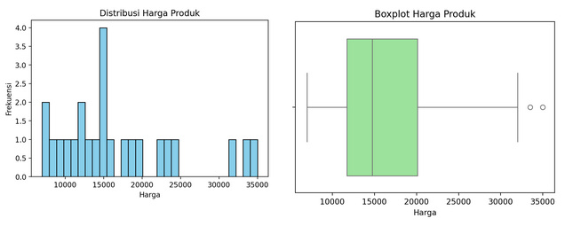
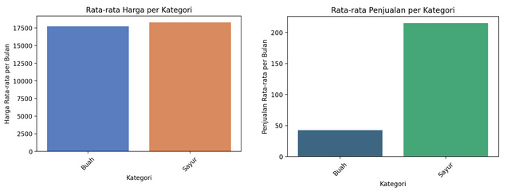

# Sistem Prediksi Harga dan Strategi Penjualan Berdasarkan Pembelajaran Mesin  

## Deskripsi Proyek  
Sistem ini dirancang untuk membantu bisnis dalam **menentukan strategi harga optimal** dan **menganalisis tren penjualan** menggunakan teknik pembelajaran mesin. Dengan pendekatan berbasis data, sistem ini dapat memberikan **prediksi harga, rekomendasi stok, analisis kompetitor, serta simulasi profit dan risiko bisnis**.  

Proyek ini menggunakan **Streamlit** sebagai dashboard interaktif dan berbagai pustaka **Python** untuk pemrosesan data dan analisis statistik.  

## Tujuan Proyek  
- **Prediksi harga jual optimal** berdasarkan tren pasar dan faktor eksternal.  
- **Analisis performa bisnis** untuk memaksimalkan profit dan mengurangi risiko.  
- **Segmentasi pelanggan** dan analisis perilaku untuk strategi pemasaran yang lebih efektif.  
- **Simulasi ROI & break-even point** untuk perencanaan keuangan bisnis.  
- **Visualisasi tren penjualan** untuk memberikan wawasan yang lebih baik dalam pengambilan keputusan.  

## Fitur Utama  

### **Prediksi & Optimasi Harga**  
- **Prediksi Harga & Rekomendasi** → Menggunakan model statistik dan ML untuk memprediksi harga optimal.  
- **Dynamic Pricing** → Penyesuaian harga secara real-time berdasarkan tren pasar.  
- **Elastisitas Harga & Optimasi Profit** → Menghitung sensitivitas harga terhadap permintaan.  

### **Analisis & Strategi Penjualan**  
- **Forecast Penjualan** → Prediksi volume penjualan dengan metode time series.  
- **Segmentasi & Clustering** → Mengelompokkan pelanggan berdasarkan pola pembelian.  
- **Analisis Kompetitor** → Perbandingan strategi harga dan penjualan dengan pesaing.  

### **Evaluasi Performa & Risiko**  
- **Simulasi Profit & ROI** → Menghitung potensi keuntungan dan pengembalian investasi.  
- **Break Even Analysis** → Menentukan titik impas dan proyeksi keuntungan.  
- **Prediksi Risiko & Ketidakpastian** → Analisis volatilitas pasar dan tren jangka panjang.  

### **Visualisasi & Dashboard**  
- **Dashboard Interaktif** → Dibangun menggunakan **Streamlit** untuk menampilkan hasil analisis secara dinamis.  
- **Visualisasi Tren Penjualan** → Grafik interaktif menggunakan **Matplotlib** & **Seaborn**.  

## Teknologi yang Digunakan  

| **Kategori**     | **Teknologi** |
|-----------------|--------------|
| **Dashboard & UI** | Streamlit |
| **Analisis Data** | Pandas, NumPy, Seaborn, Matplotlib |
| **Statistik & Model** | SciPy, Statsmodels, Scikit-learn |
| **Pemrosesan Data** | Datetime, JSON |
| **Logging & Debugging** | Logging |

## 💻 Cara Instalasi  

1. **Clone repositori**:  
   ```sh
   git clone https://github.com/fitri-hy/ml-sales-price-predictions-python.git
   ```
2. **Masuk ke direktori proyek**:  
   ```sh
   cd ml-sales-price-predictions-python
   ```
3. **Buat virtual environment dan aktifkan**:  
   ```sh
   python -m venv env
   source env/bin/activate  # Untuk macOS/Linux
   env\Scripts\activate     # Untuk Windows
   ```
4. **Install dependensi**:  
   ```sh
   pip install -r requirements.txt
   ```
5. **Jalankan aplikasi Streamlit**:  
   ```sh
   streamlit run main.py
   ```

## Contoh Visualisasi  




**Sistem Prediksi Harga dan Strategi Penjualan** membantu bisnis mengambil keputusan yang lebih cerdas dengan data!  